# DIP Project - PatchMatch

**Team cv2 \
Abhinav Raundhal - 2022101089 \
Gaurav Behera - 2022111004**

# 1. Introduction

As digital photography has advanced, numerous techniques have emerged for high-level image and video manipulation. For example, image retargeting algorithms adjust an image’s aspect ratio while preserving its visual content, and image completion algorithms seamlessly fill in removed regions by synthesising textures from the surrounding image. These techniques often rely on the observation that images can be divided into small patches, such as 7x7 pixel regions, which can then be rearranged, similar to assembling a jigsaw puzzle. However, patch-based manipulation traditionally incurs significant computational and memory costs due to the difficulty of efficiently searching for similar patches.

This project aims to reimplement and explore the Nearest Neighbour Field (NNF) algorithm from scratch in Python using the original MATLAB and C++ reference code as guides. Additionally, we have implemented a simplified image in-painting approach in Python using an Expectation-Maximisation (EM) step combined with a *Multi-Scale Coarse-to-Fine Refinement* method. This in-painting approach is inspired by another GitHub repository, whose implementation is originally in C++. We have also created a simple python GUI which allows users to load an image, draw mask regions on it and save it to be used by the algorithm.

# 2. PatchMatch

The paper introduces *PatchMatch*, an algorithm that significantly accelerates the search for matching image patches, achieving speeds 20-100x faster than prior methods while using much less memory. By leveraging the natural statistical coherence of adjacent patches in images, the algorithm quickly computes nearest-neighbour matches for densely overlapping patches—one per pixel. This method has applications in image in-painting, retargeting, and reshuffling, which are also demonstrated in this project.

PatchMatch has been widely adopted and integrated into Adobe's image and video editing tools, particularly in Photoshop and After Effects. One prominent application is the **Content-Aware Fill** feature, which leverages PatchMatch for efficient and high-quality image and video in-painting. This feature allows users to seamlessly remove unwanted objects or regions from images or videos by synthesising plausible content based on surrounding textures.

# 3. Methodology

## 3.1 Image Details

Natural images exhibit two key statistical properties that facilitate efficient search algorithms: *coherence* and a *peaked distribution*. Coherence refers to the tendency of adjacent patches in an image to have similar nearest neighbours, meaning that good matches for one patch are likely to inform the matches for nearby patches. The peaked distribution implies that the best matches for a given patch are often located spatially close to its position in the source or target image. By leveraging these properties, search algorithms can propagate good matches across neighbouring patches and concentrate computational efforts on nearby regions, significantly improving both the speed and accuracy of finding nearest-neighbour patches between images.


High level motivation behind the algorithm. We match descriptors computed on two manifolds, visualised as colour circles. Each descriptor independently finds its most similar match in the other manifold. Coherence here could be indicated by the red descriptor being similar to the purple descriptor, and that their nearest neighbours are spatially close to each other.

## 3.2 Nearest Neighbour Field (NNF) Algorithm

The core of the system revolves around an efficient algorithm for computing **patch correspondences** between two images. The main challenge is to identify the best matching patches in one image that correspond to a patch in another image. To solve this, we define a **Nearest-Neighbour Field (NNF)**, which is a function $f : A \rightarrow \mathbb{R}^2$ that maps every patch in image $A$ to a patch in image $B$, effectively specifying where the corresponding patch in image $B$ is located.

Formally, for a given patch at coordinate $a$ in image $A$, the corresponding nearest patch in image $B$ is located at coordinate $b$, and the NNF function is defined as $f(a) = b$.


Phases of the randomised nearest neighbour algorithm: (a) patches initially have random assignments; (b) the blue patch checks above/green and left/red neighbours to see if they will improve the blue mapping, propagating good matches; (c) the patch searches randomly for improvements in concentric neighbourhoods.

### 3.2.1 Initialisation

The initialisation phase of the algorithm involves filling the nearest-neighbour field with an initial set of correspondences. This can be done in two ways:

- **Random Initialisation**: We begin by assigning random coordinates within the possible range of image B. This randomness is uniformly distributed across the full image, ensuring that the search space is broadly covered.
- **Prior Information**: In some applications, we use prior information to initialise the nearest-neighbour field. For instance, in our in-painting implementation, we start with an initialisation from a coarser level, progressively refining it as the resolution increases.

Here are the pseudo codes for few initialisation instances:

```python
Function initialize_nnf():
    For each pixel (ay, ax) in the source image:
        If pixel is in border:
            Set NNF[ay, ax] to (ay, ax)
            Set NNF distance[ay, ax] to 0
        Else:
            Randomly select bx, by from the target image
            Set NNF[ay, ax] to (by, bx)
            Set NNF distance[ay, ax] to patch_distance(ax, ay, bx, by)
```

```python
Function initialize_nnf_with_other_nnf(other_nnf):
    Upsample the other NNF by a factor of 2
    For each pixel (ay, ax) in the source image:
        If pixel is in border:
            Set NNF[ay, ax] to (ay, ax)
            Set NNF distance[ay, ax] to 0
        Else:
            Get corresponding bx, by from the upsampled other NNF
            Set NNF[ay, ax] to (by, bx)
            Set NNF distance[ay, ax] to patch_distance(ax, ay, bx, by)
```

```python
Function initialize_nnf_with_mask(mask):
    For each pixel (ay, ax) in the source image:
        If pixel needs inpainting (mask[ay, ax] == 0) and is not in border:
            Randomly select bx, by from the target image
            Set NNF[ay, ax] to (by, bx)
            Set NNF distance[ay, ax] to patch_distance(ax, ay, bx, by)
        Else:
            Set NNF[ay, ax] to (ay, ax)
            Set NNF distance[ay, ax] to 0
```

After initialisation, we iteratively improve the nearest-neighbour field by refining the offsets. Each iteration consists of two major steps: **Propagation** and **Random Search**. These steps are interleaved at the patch level, meaning that we alternate between propagating good offsets and performing random search to explore nearby offsets for better matches.

### 3.2.2 Propagation

Propagation is a key step where good offset estimates are transferred to neighbouring patches. Specifically, for a given patch at coordinate $(a_x, a_y)$, we assume that the nearest neighbour of this patch is likely similar to the nearest neighbour of the patches at coordinates $(a_x-1, a_y)$ and $(a_x, a_y-1)$. This assumption is based on the observation that patches in natural images tend to have locally coherent structures. Therefore, we attempt to improve the offset $f(a_x, a_y)$ by considering the offsets from the neighbouring patches$f(a_x-1, a_y)$ and $f(a_x, a_y-1)$.

Mathematically, this process can be described as:

$$
f(x, y) = \arg \min_{v} \left\{ D(f(x, y)), D(f(x-1, y)), D(f(x, y-1)) \right\}
$$

Here, $D(f(x,y))$ represents the error (or distance) between the patch at position $(x,y)$ in image $A$ and the patch at position $f(x,y)$ in image $B$ defined as the squared RGB distance between the two patches. This step ensures that regions of the image that have already been matched correctly will propagate these matches to their neighbours.

Additionally, to ensure that the propagation is not limited to one direction, the algorithm performs a reverse scan during even iterations. In this reverse pass, offsets from the neighbouring patches $f(a_x+1,a_y)$ and $f(a_x,a_y+1)$ are used to propagate the best matches upwards and leftwards.

Here is the pseudo code for the propagation step:

```python
Function propagate(iter_num, ax, ay, x_change, y_change):
    d_best = nnf_dist[ay, ax]  # Current best distance

    If ax - x_change is within bounds:
        (y_prop, x_prop) = nnf[ay, ax - x_change]
        x_prop += x_change
        If x_prop is within bounds:
            improve_guess(ax, ay, d_best, x_prop, y_prop)

    If ay - y_change is within bounds:
        (y_prop, x_prop) = nnf[ay - y_change, ax]
        y_prop += y_change
        If y_prop is within bounds:
            improve_guess(ax, ay, d_best, x_prop, y_prop)

```

### 3.2.3 Random Search

After propagation, the next step is **random search**. In this phase, we attempt to improve the current offset by exploring nearby offsets. We begin by considering the current offset as a starting point, and then generate candidate offsets by adding random variations. The candidate offsets are computed as:

$$
u_i = v_0 + w \alpha^i R_i
$$

where $w$ is the maximum search radius, $\alpha$ is a fixed ratio that controls the scaling of the search radius at each iteration (usually set to $1/2$), $R_i$ is a random vector uniformly distributed in the range $[−1,1]$, ensuring random exploration in both the horizontal and vertical directions.

The random search continues with exponentially decreasing distances, refining the search radius until it becomes less than 1 pixel. The search process is halted when the radius is small enough, ensuring that the best matching offset is found within a reasonable distance.

Here is the pseudo code for the random search step:

```python
Function random_search(ax, ay):
    Initialize rs_start as the smaller of rs_max and max(image dimensions)
    Set mag = rs_start

    While mag >= 1:
        (y_best, x_best) = nnf[ay, ax]
        d_best = nnf_dist[ay, ax]

        x_min = max(x_best - mag, 0)
        x_max = min(x_best + mag + 1, bw)
        y_min = max(y_best - mag, 0)
        y_max = min(y_best + mag + 1, bh)

        If x_min == x_max or y_min == y_max:
            Reduce mag by half and continue

        Randomly select x_rand in [x_min, x_max)
        Randomly select y_rand in [y_min, y_max)

        improve_guess(ax, ay, d_best, x_rand, y_rand)

        Reduce mag by half
```

### 3.2.4 Other Implementation Details

1. **Evaluation Criteria:** We evaluate these candidates and update the nearest neighbour if any of them provide a smaller patch distance defined by the l2-norm of the difference of RGB values. In cases where a mask is present as part of the patch, the distance is penalised by adding a large value.
2. **Halting Criteria:** We iterate the above process a fixed number of times (typically 4-5 iterations) until the NNF converges, meaning that further iterations no longer significantly improve the nearest neighbour assignments.
3. **Patch Width:** The patch width is set to 7 pixels, as this size strikes a balance between capturing meaningful texture patterns and maintaining computational efficiency. Smaller patches might miss broader textures, while larger ones increase computation and risk over-smoothing. 

## 3.3 In-painting Application

We have implemented image in-painting using the PatchMatch’s Nearest Neighbour Field algorithm. It operates through a multi-resolution **coarse-to-fine refinement** strategy, incorporating **Expectation-Maximisation (EM)** to iteratively update the masked regions.

### 3.3.1 Initialisation

The algorithm begins with the initialisation of inputs: the **image** (a 3D array representing pixel colours), the **mask** (a binary 2D array marking known and missing regions), and hyper-parameters like the patch size (`patch_w`) and maximum PatchMatch iterations (`max_pm_iters`). 

The mask ensures that in-painting is confined to the specified missing regions. A key step in initialisation is constructing an **image pyramid**, which stores progressively smaller versions of the image and mask for coarse-to-fine processing. This multi-scale approach enables structural and texture consistency by addressing global details at lower resolutions and refining finer details at higher resolutions.

### 3.3.2 Pyramid Construction

The image and mask are repeatedly downsampled by a factor (e.g., 2) until the dimensions of the smallest image are close to the patch size. During downsampling, the `_downsample_img_and_mask` method applies Gaussian smoothing using a custom kernel.

This reduces noise and ensures smooth transitions between resolutions. Missing regions in the mask are proportionally propagated by averaging weighted contributions from neighbouring pixels. The pyramid serves as a foundation for coarse-to-fine in-painting, starting from the smallest (coarsest) resolution.

### 3.3.3 EM Optimisation

The **Expectation-Maximisation (EM)** process alternates between estimating pixel values (E-step) and updating them (M-step):

- **E-Step**: Weighted contributions from nearby patches are aggregated to form "votes" for the in-painted region. For each pixel, the weight $w$ of a patch at coordinates $(a_x,a_y)$ in the source and $(b_x,b_y)$ in the target represents the similarity and is calculated as:
    
    $$
    w = 1 - \frac{d(P_A, P_B)}{\text{MAX\_PATCH\_DIFF}}
    $$
    
    These weights are normalised, and pixel values are updated based on the contributions of overlapping patches.
    
- **M-Step**: Pixel values in missing regions are updated by averaging the weighted votes. This step ensures a gradual refinement of missing areas, balancing contributions from the surrounding context.

Here are the pseudo codes for the EM Step:

```python
function E_STEP(nnf, src_image, mask, upscale=False):
    initialize votes as zeros array of shape (height, width, 4)
    
    for each pixel (ay, ax) in source image:
        (by, bx) = nnf[ay, ax]  // Nearest neighbor coordinates
        weight = 1 - (patch_distance(ax, ay, bx, by) / MAX_PATCH_DIFF)

        if upscale:
            // Handle upscaled patches (2x2 neighborhood)
            votes += weighted_copy(2*ax, 2*ay, 2*bx, 2*by)
            votes += weighted_copy(2*ax+1, 2*ay, 2*bx+1, 2*by)
            votes += weighted_copy(2*ax, 2*ay+1, 2*bx, 2*by+1)
            votes += weighted_copy(2*ax+1, 2*ay+1, 2*bx+1, 2*by+1)
        else:
            votes += weighted_copy(ax, ay, bx, by)

    return votes
```

```python
function M_STEP(target_image, votes):
    initialize new_target as a copy of target_image
    
    for each pixel (by, bx) in target image:
        if votes[by, bx, 3] > 0:  // Normalize only if votes exist
            new_target[by, bx, 0] /= votes[by, bx, 3]  // Blue
            new_target[by, bx, 1] /= votes[by, bx, 3]  // Green
            new_target[by, bx, 2] /= votes[by, bx, 3]  // Red

    return new_target
```

### 3.3.4. Multi-Scale Coarse-to-Fine Refinement

The coarse-to-fine refinement process begins at the coarsest pyramid level, where global structures are addressed. In-painting starts by initialising missing regions using PatchMatch and iteratively refining them using the EM steps. Once the coarsest level is complete, the inpainted result is **upsampled** to the next resolution using bilinear interpolation, ensuring continuity. The NNF from the coarser level is propagated to initialise PatchMatch at the finer level, reducing computational overhead and preserving structural consistency. This process repeats for all levels until the highest resolution is reached, where fine details are reconstructed.

Here is the pseudo code for this:

```python
function inpaint(image_pyramid, mask_pyramid, patch_size, max_pm_iters):
    initialize inpainted_image = None

    for level from coarsest to finest:
        src_image, mask = image_pyramid[level], mask_pyramid[level]
        
        if level == coarsest:
            initialize inpainted_image and nearest neighbor fields (NNFs)
        else:
            update NNFs using results from the previous level
        
        for em_step in range(max_em_steps(level)):
            votes = compute_votes(src_image, mask, NNFs, upscale)
            inpainted_image = update_image_from_votes(inpainted_image, votes)
            update_NNFs_with_inpainted_image(NNFs, inpainted_image)
        
        if level > finest:
            upscale inpainted_image for the next level

    return inpainted_image
```

### 3.3.5 Output

At the finest resolution, the in-painted image contains reconstructed regions that are visually consistent with the surrounding context. The combination of PatchMatch for texture synthesis and EM for iterative refinement ensures that the output maintains high structural fidelity and realistic textures. Mathematically, the process converges to a solution that minimises the patch distance across scales, effectively filling the missing regions while preserving global coherence and local detail.

# 4. Results

## 4.1 NNF - Reconstruction

These are original input images $A$ and $B$ passed as inputs to the NNF algorithm. The algorithm outputs the NNF which stores the offsets from image $A$ to $B$. Essentially, each pixel in image $A$ stores the corresponding best matching patch in $B$.


Computing the NNF from two images A and B

Here is the detailed NNF output of the algorithm:

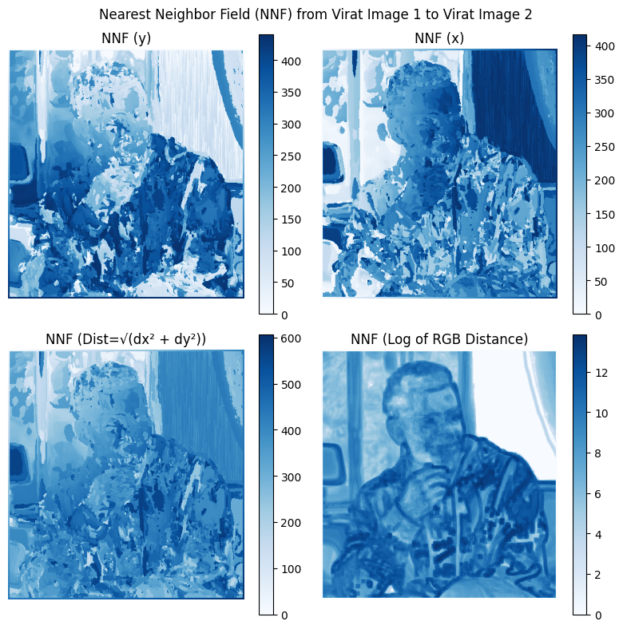

1. $NNF(y)$ represents the pixel distance difference along the $y$ axis

2. $NNF(x)$ represents the pixel distance difference along the $x$ axis

3. The $NNF(Dist)$ represents the magnitude of distance combining $NNF(x)$ and $NNF(y)$

4. The $NNF(RGB dist)$ represents the pixel intensity difference between each patch in $A$ and $B$

Similarly grouped regions in the above plots indicate the coherence of the images.

The image $A$ can be reconstructed from $B$ and the NNF ($A$ to $B$) using two approaches:

1. Directly replacing the pixel value with the centre of the NNF patch in $B$
2. Replacing patches for each pixel centre and averaging the pixel intensities over all overlapping patches

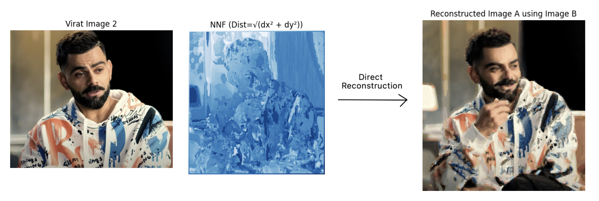

Reconstruction using direct pixel transfer method

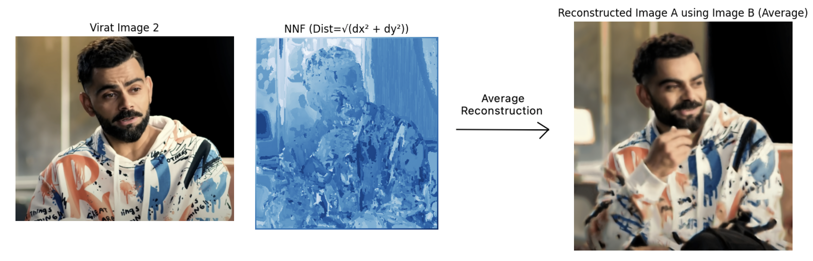

Reconstruction using averaged patch method

The direct pixel replacement reconstruction method (1) results in some inconsistent spots compared to the averaging method (2). The averaging method provides much better results for the reconstruction task with smoother blending of patches.

## 4.2 Image In-painting

The mask of an input image can be created using the mask creator tool by running `get_mask.py`

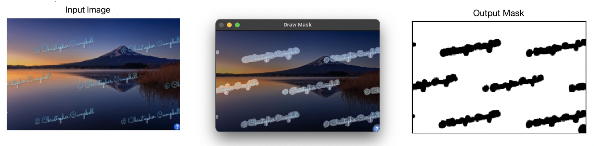

Mask Creation

The in-painting algorithm starts by downscaling the image and mask multiple times. At each level, the Expectation-Maximisation code is run multiple times and constructs the target image. The reconstructed target image is passed as initialisation to the lower level and the process it repeated till the final resolution image is obtained. 

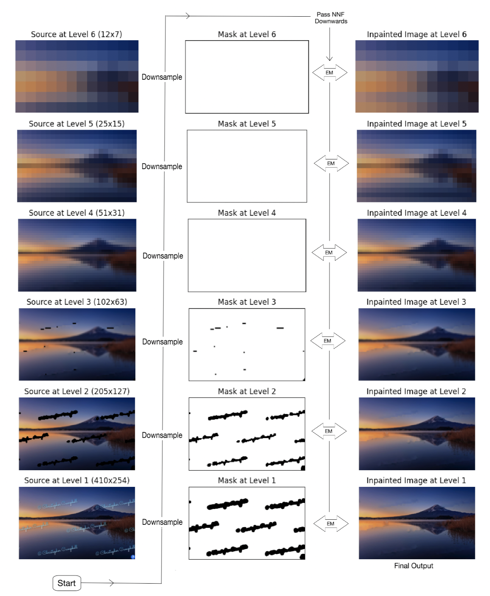

Algorithm overview for in-painting (watermark removal)

**Here are the results for some more images:**

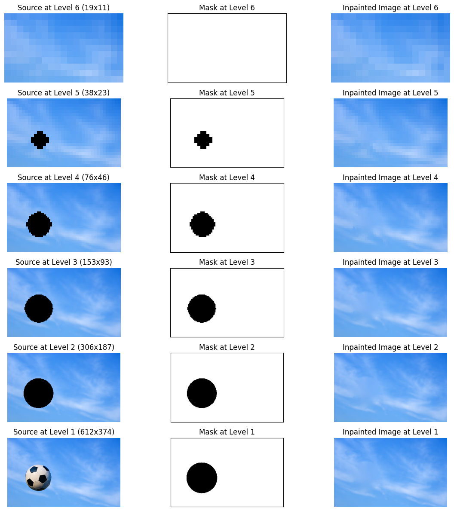

In-painting for Object Removal

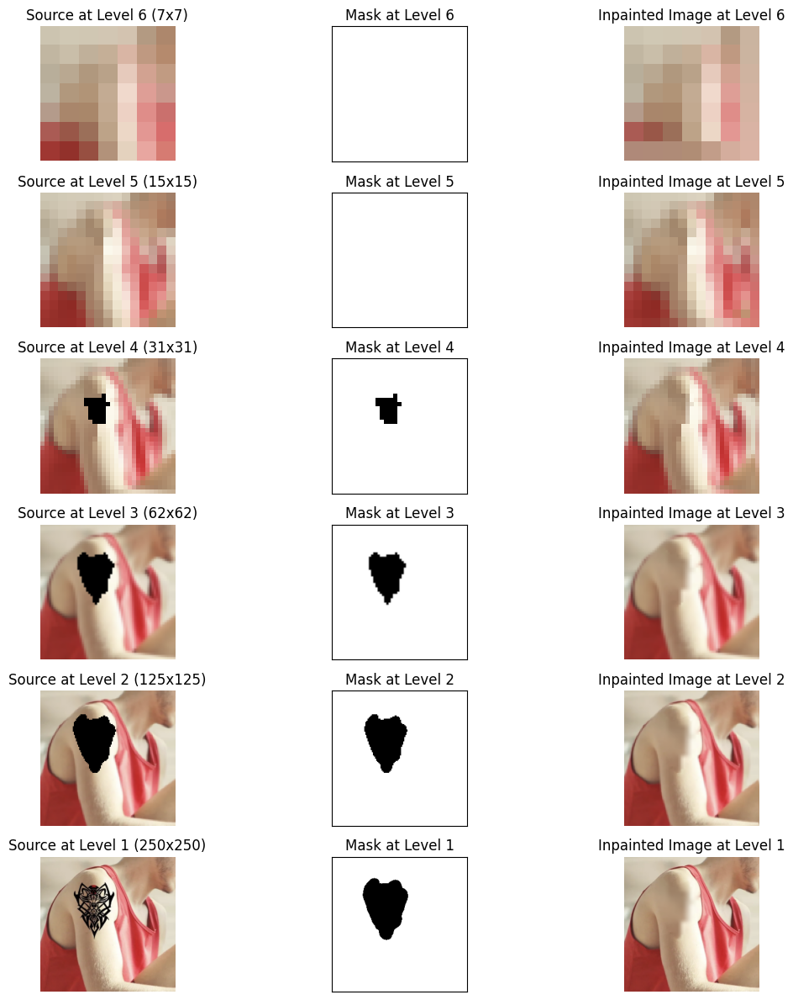

In-painting for Tattoo Removal

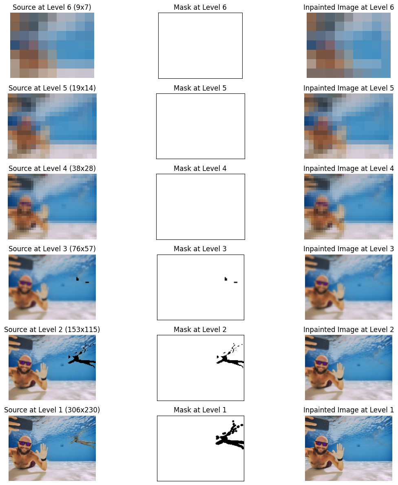

In-painting using both propagation and random search.

## 4.3 Ablation Study

We compare the the effectiveness of the propagate and random search steps in the NNF computation for the task of image in-painting. 

The three cases we test are:

1. Both Propagate and Random Search
2. Only Random Search (No propagate)
3. Only Propagate (No random search)

We evaluate the three cases on one image:

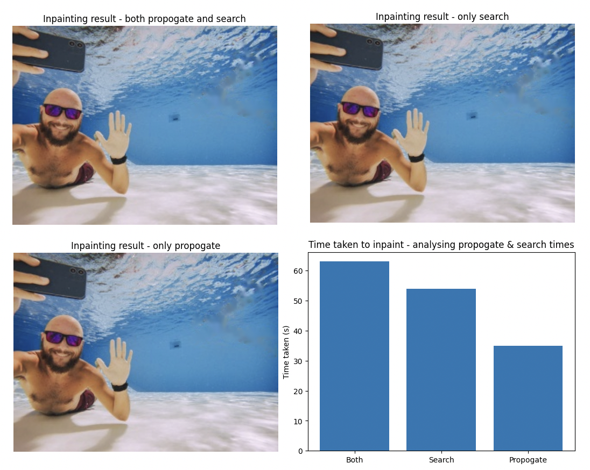

Ablation Results

There is almost no visual difference between the three images implying that both the individual steps perform good enough results independently such that combining both does not improve the final output. The only difference is in the time taken. Only Propagation takes only 35 seconds compared to 54 seconds taken by only Search and 63 seconds taken by both. Thus, we can achieve good results within a fraction of the time by only keeping the Propagation step of the algorithm while removing the Random Search step. 

We confirm this hypothesis by evaluating another image:

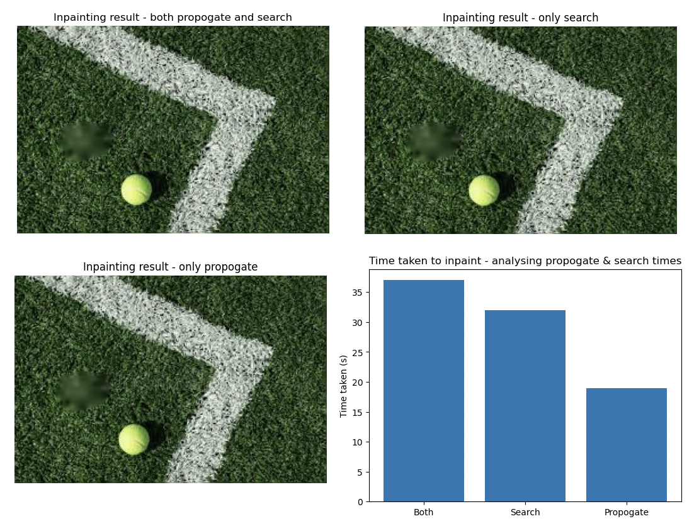

Ablation Results

We notice similar results here. Only Propagate (no Random Search) is the best choice among the three options in terms of times taken.

## 4.4 Image Reshuffling

Image reshuffling algorithms make it possible to grab portions of the image and move
them around – the computer automatically synthesises the remainder of the image so as to resemble the original while respecting the moved regions.

To perform image reshuffling using image in-painting, we first copy the portion of the image we want to move, and paste it on the original image to obtain the edited image. Now we define the mask for removing the original object as well as smoothening out the edges between the newly placed object and the background. This mask is applied on the edited image to obtain the final reshuffled image.

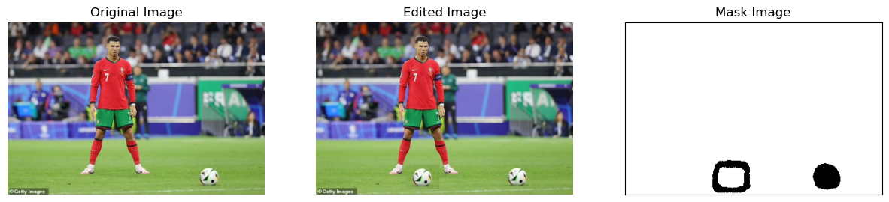

Defining the edited image and the masked image.

Here is the level wise construction of the in-painted image:

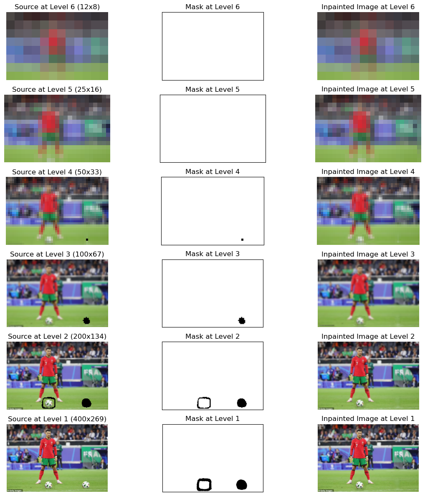

Image reshuffling

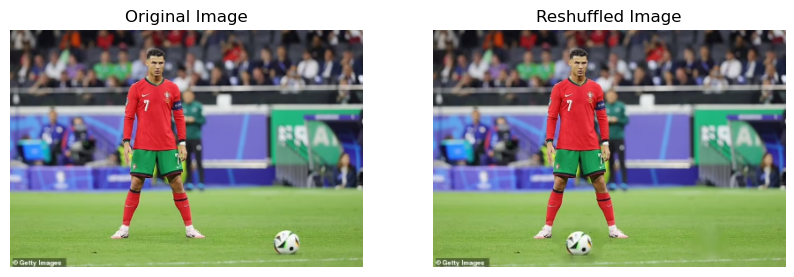

Final Reshuffled image

# 5. References

[dl.acm.org](https://dl.acm.org/doi/pdf/10.1145/1531326.1531330)

[gfx.cs.princeton.edu](https://gfx.cs.princeton.edu/pubs/_2011_PAF/connelly_barnes_phd_thesis.pdf)

[GitHub - ZQPei/patchmatch_inpainting: Implementation of PatchMatch for image inpainting in cpp](https://github.com/ZQPei/patchmatch_inpainting)

[PatchMatch - A Randomized Correspondence Algorithm for Structural Image Editing](https://www.youtube.com/watch?v=fMe19oTz6vk)